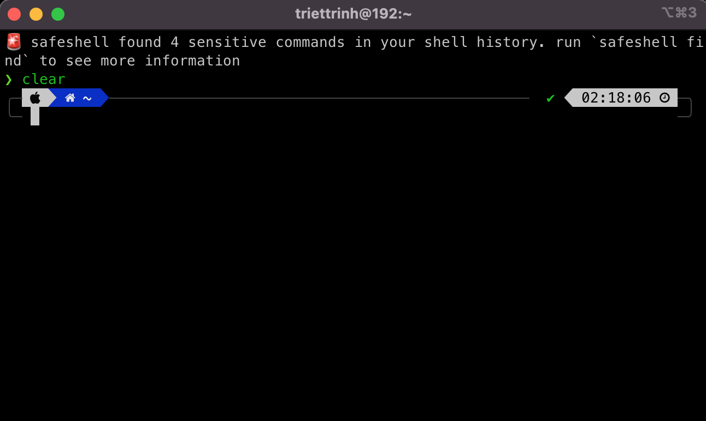

# 🛡️ SafeShell

```text
 ____           __        ____   _            _  _
/ ___|   __ _  / _|  ___ / ___| | |__    ___ | || |
\___ \  / _` || |_  / _ \\___ \ | '_ \  / _ \| || |
 ___) || (_| ||  _||  __/ ___) || | | ||  __/| || |
|____/  \__,_||_|   \___||____/ |_| |_| \___||_||_|
```

🛡️ SafeShell: A security tool for shell history management, designed to detect, stash, and clear sensitive commands, ensuring safer terminal sessions.

## ✨ Features

🖥️ Display a summary of sensitive commands at the start of each terminal session.
👀 Remove sensitive commands from the shell history to enhance security and privacy.
👨‍💻 Temporarily store your command history prior to presentations or screen-sharing sessions for confidentiality.

## 🚀 Installation

To install **safeshell**, simply clone the repository and follow the instructions below:

```bash
git clone git@github.com:trinhminhtriet/safeshell.git
cd safeshell

cargo install --path .
```

Running the below command will globally install the `safeshell` binary.

```bash
cargo install safeshell
```

<details>
<summary>macOS</summary>

```sh
curl -sS https://raw.githubusercontent.com/trinhminhtriet/safeshell/master/install/install.sh | bash
```

</details>

<details>
<summary>Linux</summary>

```sh
curl -sS https://raw.githubusercontent.com/trinhminhtriet/safeshell/master/install/install.sh | bash
```

</details>

<details>
<summary>Windows</summary>

```sh
iwr https://raw.githubusercontent.com/trinhminhtriet/safeshell/master/install/install.ps1 -useb | iex
```

</details>

### Setup your shell

<details>
<summary>Bash</summary>
Add the following to the end of ~/.bashrc:

```sh
eval $(safeshell --init-shell)
```

</details>

<details>
<summary>Zsh</summary>
Add the following to the end of ~/.zshrc:

```sh
eval $(safeshell --init-shell)
```

</details>

<details>
<summary>PowerShell</summary>
Add the following to the end of your PowerShell configuration (find it by running $PROFILE):

```powershell
Invoke-Expression (&safeshell --init-shell)
```

</details>

<details>
<summary>Fish</summary>
Add the following to the end of ~/.config/fish/config.fish:

```sh
safeshell --init-shell | source
```

</details>



## 💡 Usage

```sh
$ safeshell --help

Secure shell commands

USAGE:
    safeshell [OPTIONS] [SUBCOMMAND]

OPTIONS:
        --config-dir <CFG_DIR_PATH>    Set configuration directory path
    -h, --help                         Print help information
        --init-shell                   Show sensitive findings summary for MOTD
        --log <LEVEL>                  Set logging level [default: INFO] [possible values: OFF,
                                       TRACE, DEBUG, INFO, WARN, ERROR]
        --no-banner                    Don't show the banner
    -V, --version                      Print version information


SUBCOMMANDS:
    config     Create custom configuration
    find       Find sensitive commands
    help       Print this message or the help of the given subcommand(s)
    restore    Restore backup history file
    stash      Stash history file
```

### 👀 Find Sensitive Commands

Sensitive data can be stored in your history file when export a token of something or running a script with token.

```sh
safeshell find --format table
```


### 🪄 Mask findings:

```sh
safeshell clear
```

### 🔥 Remove findings:

```sh
safeshell clear --remove
```

### 💼 Backup shell history before clear

```sh
safeshell clear --backup
```

### 🙈 Stash/Pop/Restore

You can stash your history shell by running the command:

```sh
safeshell stash
```

Now your history shell is clear, to bring back your history run the command:

```sh
safeshell stash pop
```

You can also restore your history backup file by running the command:

```sh
safeshell stash restore
```

### 𓂃🖌 External Configuration

Create custom configuration by running the command

```sh
safeshell config
```

Config command will create:

1. Custom pattern template for adding a custom risky patterns
2. Ignore file to allows you ignore specific pattern

### 🛠️ Validate Config Files

Validate syntax file

```sh
safeshell config validate
```

### 🚮 Delete Config Folder

Validate syntax file

```sh
safeshell config delete
```

### ⏭ Ignore patterns

Manage pattern ignores

```sh
safeshell config ignores
```

# Examples

[All the examples here](./example/README.md)

## 🗑️ Uninstallation

Running the below command will globally uninstall the `safeshell` binary.

```bash
cargo uninstall safeshell
```

Remove the project repo

```bash
rm -rf /path/to/git/clone/safeshell
```

## 🤝 How to contribute

We welcome contributions!

- Fork this repository;
- Create a branch with your feature: `git checkout -b my-feature`;
- Commit your changes: `git commit -m "feat: my new feature"`;
- Push to your branch: `git push origin my-feature`.

Once your pull request has been merged, you can delete your branch.

## 📝 License

This project is licensed under the MIT License - see the [LICENSE](LICENSE) file for details.
